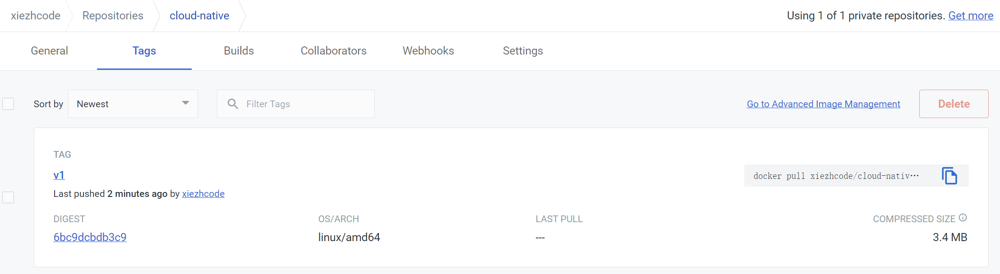
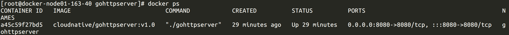

# 模块三

1. 构建本地镜像，编写 Dockerfile 将模块二作业编写的 httpserver 容器化

```dockerfile
FROM golang:1.18.7 AS builder

ENV GOOS linux
ENV GOARCH amd64
ENV GOPROXY https://goproxy.cn,direct
ENV CGO_ENABLED 0

RUN mkdir -p /workspace/apps/
WORKDIR /workspace/apps/
COPY . /workspace/apps/
RUN GOOS=linux GOARCH=amd64 CGO_ENABLED=0 go build -o gohttpserver -a -installsuffix ./main.go

FROM scratch
COPY --from=builder /workspace/apps/gohttpserver .
EXPOSE 8080
CMD ["./gohttpserver"]
```

2. 将镜像推送至 docker 官方镜像仓库

- 首先先登录 docker hub 账号

```shell
[root@docker-node01-163-40 gohttpserver] # docker login --username=xiezhcode
Password:
WARNING! Your password will be stored unencrypted in /root/.docker/config.json.
Configure a credential helper to remove this warning. See
https://docs.docker.com/engine/reference/commandline/login/#credentials-store

Login Succeeded
```

- 查看本地镜像

```shell
[root@docker-node01-163-40 gohttpserver] # docker images
REPOSITORY                 TAG       IMAGE ID       CREATED          SIZE
<none>                     <none>    244fe4301a8d   17 minutes ago   1.03GB
cloudnative/gohttpserver   v1.0      250b7978829d   17 minutes ago   6.25MB
golang                     1.18.7    5fedf7be08ce   10 days ago      965MB
alpine                     latest    9c6f07244728   2 months ago     5.54MB
```

- 修改镜像名称

```shell
[root@docker-node01-163-40 gohttpserver] # docker tag 250b7978829d xiezhcode/cloud-native:v1
[root@docker-node01-163-40 gohttpserver] # docker images
REPOSITORY                 TAG       IMAGE ID       CREATED          SIZE
cloudnative/gohttpserver   v1.0      250b7978829d   22 minutes ago   6.25MB
xiezhcode/cloud-native     v1        250b7978829d   22 minutes ago   6.25MB
<none>                     <none>    244fe4301a8d   22 minutes ago   1.03GB
golang                     1.18.7    5fedf7be08ce   10 days ago      965MB
alpine                     latest    9c6f07244728   2 months ago     5.54MB
```

- 推送镜像

```shell
[root@docker-node01-163-40 gohttpserver] # docker push xiezhcode/cloud-native:v1
The push refers to repository [docker.io/xiezhcode/cloud-native]
efde23b57c93: Pushed
v1: digest: sha256:6bc9dcbdb3c9732f3e93c55b5cb12babf8377558d736ffc5a10820cb6f3dd9a3 size: 528
```



3. 通过 docker 命令本地启动 httpserver

```shell
docker run --rm -d -p 8080:8080 --name gohttpserver cloudnative/gohttpserver:v1.0
```



4. 通过 nsenter 进入容器查看 IP 配置

- 查看进程 PID 

```shell
[root@docker-node01-163-40 gohttpserver] # ps -ef | grep go
root      13720  13700  0 14:22 ?        00:00:00 ./gohttpserver
```

- 查看 IP 配置

```shell
[root@docker-node01-163-40 gohttpserver] # nsenter -t 13720 -n ip addr
1: lo: <LOOPBACK,UP,LOWER_UP> mtu 65536 qdisc noqueue state UNKNOWN group default qlen 1000
    link/loopback 00:00:00:00:00:00 brd 00:00:00:00:00:00
    inet 127.0.0.1/8 scope host lo
       valid_lft forever preferred_lft forever
66: eth0@if67: <BROADCAST,MULTICAST,UP,LOWER_UP> mtu 1500 qdisc noqueue state UP group default
    link/ether 02:42:ac:11:00:02 brd ff:ff:ff:ff:ff:ff link-netnsid 0
    inet 172.17.0.2/16 brd 172.17.255.255 scope global eth0
       valid_lft forever preferred_lft forever
```

